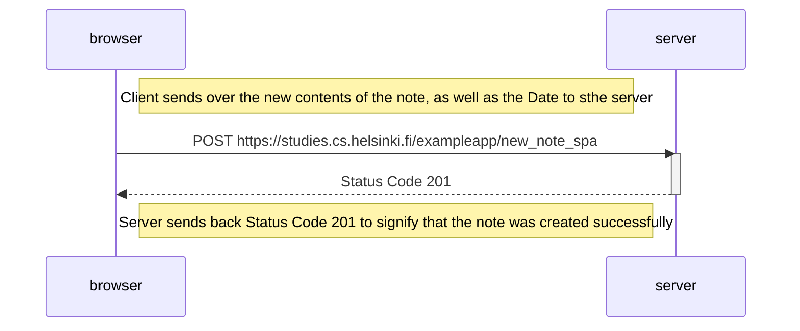

```mermaid
sequenceDiagram
    participant browser
    participant server

    Note right of browser: Client sends over the new contents of the note, as well as the Date to sthe server
    browser->>server: POST https://studies.cs.helsinki.fi/exampleapp/new_note_spa
    activate server
    server-->>browser: Status Code 201
    deactivate server
    Note right of browser: Server sends back Status Code 201 to signify that the note was created successfully
```